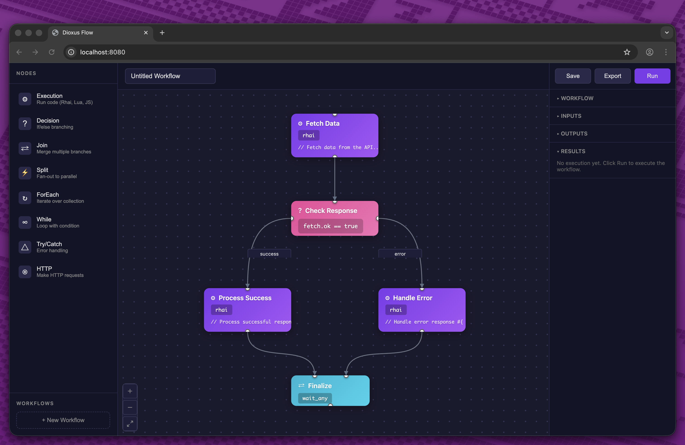

# dioxus-flow

An xyflow-like library for building node-based editors and interactive diagrams in [Dioxus](https://dioxuslabs.com/).



## Features

- **Nodes**: Draggable nodes with customizable content
- **Edges**: Connections between nodes with different edge types
- **Handles**: Connection points for creating edges
- **Canvas**: Pannable and zoomable viewport
- **Interactive**: Full mouse and touch support for interactions

## Installation

Add this to your `Cargo.toml`:

```toml
[dependencies]
dioxus-flow = "0.1"
```

## Quick Start

```rust
use dioxus::prelude::*;
use dioxus_flow::prelude::*;

fn App() -> Element {
    let nodes = use_signal(|| vec![
        Node::new("1", 100.0, 100.0).with_data("Node 1"),
        Node::new("2", 300.0, 200.0).with_data("Node 2"),
    ]);

    let edges = use_signal(|| vec![
        Edge::new("e1", "1", "2"),
    ]);

    rsx! {
        Flow {
            nodes: nodes,
            edges: edges,
        }
    }
}
```

## Examples

```bash
# Data pipeline builder with multiple handles
dx serve --example multi_handles

# Custom styled nodes
dx serve --example custom_nodes

# CI/CD workflow visualization
dx serve --example workflow

# Full feature showcase
dx serve --example full_features
```

## License

Licensed under either of Apache License, Version 2.0 or MIT license at your option.
